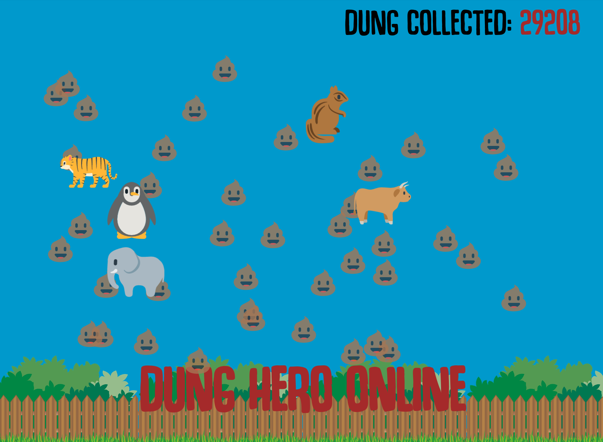

# Dung-Collector
A stupid Python3 + Selenium script to collect dung from [dunghero.online](https://dunghero.online/)

## About

[dunghero.online](https://dunghero.online/) is a simple online collaborative game created by [Coding Garden](https://www.youtube.com/channel/UCLNgu_OupwoeESgtab33CCw).
The sole focus of the game is to collaboratively collect all of the turds that are generated by the animals on the 
screen. 

## Instructions

1. Ensure Python 3 is installed.
2. Install `selenium` from pip 
    - (Can use `pip -r requirements.txt`).
3. Download the correct version of [chromedriver](https://chromedriver.chromium.org/) for your system.
4. Ensure `dung_collector.py` is referencing the correct location of your Chrome / Chromium executable.
5. Invoke `dun_collector.py` by running `python3 dung_collector.py`.

## Screenshot of Dung hero online

